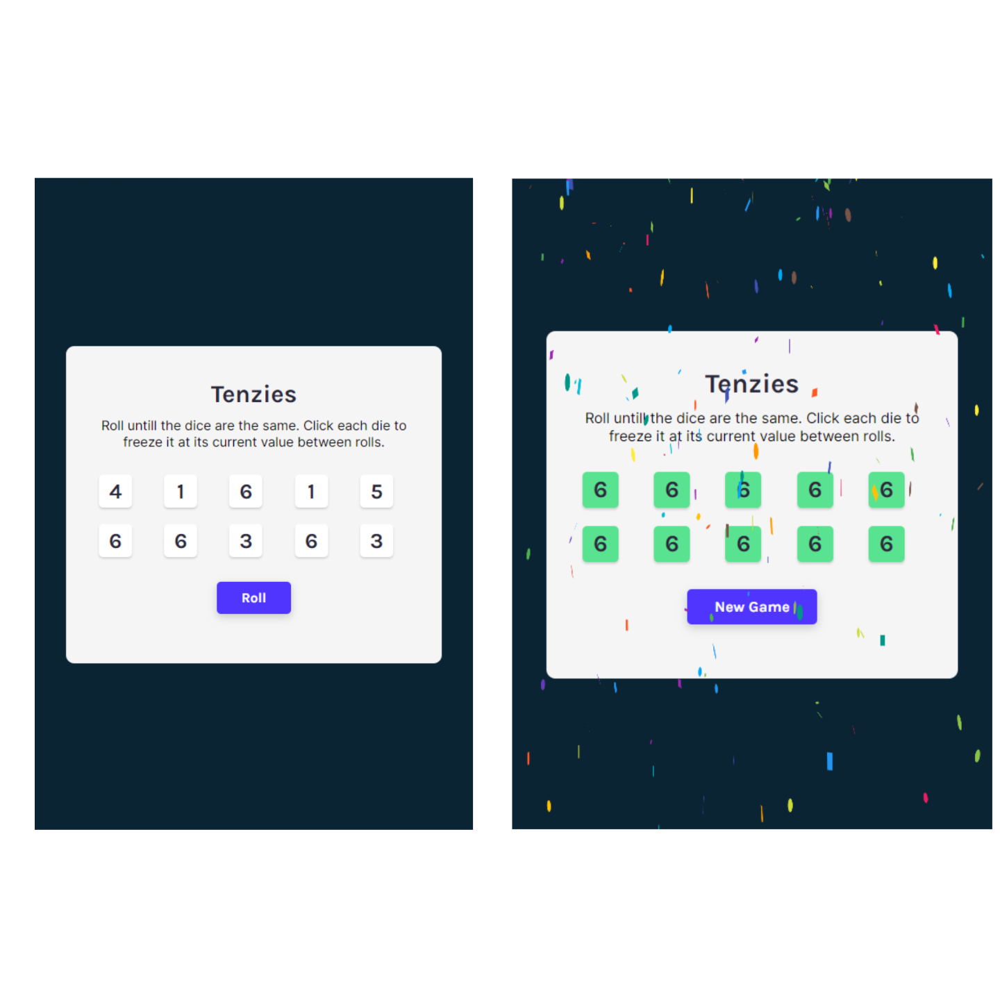

# Tenzies Game | React dice rolling game

This is a dice rolling and matching game called **Tenzies** made with React JS.

## Table of contents

- [Overview](#overview)
  - [Instructions](#instructions)
  - [Screenshot](#screenshot)
  - [Links](#links)
- [My process](#my-process)
  - [Built with](#built-with)
  - [Continued development](#continued-development)
  - [Useful resources](#useful-resources)
- [Author](#author)
- [Acknowledgments](#acknowledgments)

## Overview

### Instructions

- Roll untill the dice are the same.
- Click each die to freeze it at its current value between rolls.
- You can undo holding die by clicking/pressing it again.
- See how quickly you can match the dice with less roll.

### Screenshot

### Links

- Live Site URL: [https://drougnov.github.io/Tenzies-Game/](https://drougnov.github.io/Tenzies-Game/)

## My process

### Built with

- Semantic HTML5 markup
- CSS custom properties
- Flexbox
- CSS Grid
- [React](https://reactjs.org/) - JS library

### Continued development

I'm planning to add some of these features later in this project:

- Put dot instead of numbers in die
- Show how much time did the user take to match the dice
- Save the best time and rolls on localStorage

### Useful resources

- [Scrimba's react crash course](https://scrimba.com/learn/learnreact) - This project idea was taken from Scrimba's react course from where I've been learning React.
- [stackOverFlow](https://stackoverflow.com/)
- [Google](https://google.com)

## Author

- Frontend Mentor - [@Drougnov](https://www.frontendmentor.io/profile/Drougnov)
- Facebook - [Biplob Barua Rocky](https://www.facebook.com/ANT1D0t35)

## Acknowledgments

If you have any suggestions following this project or anything else, please let me know. Have a good day :)
